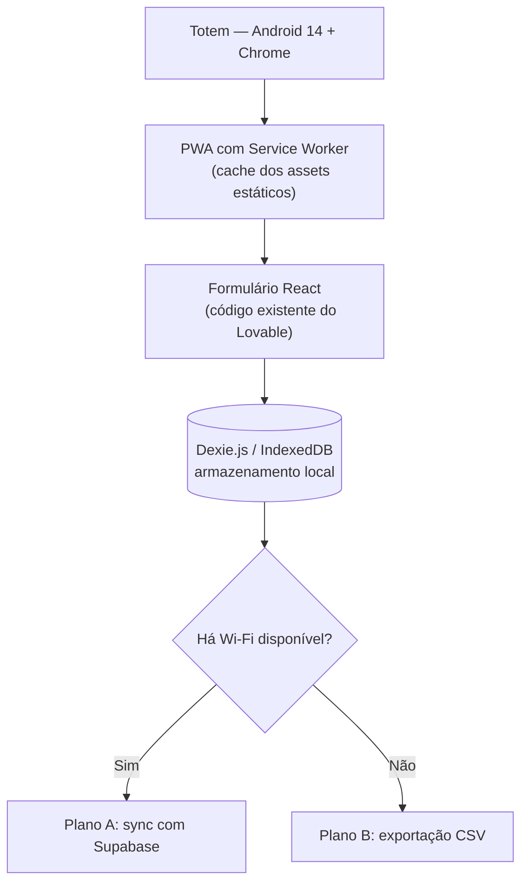
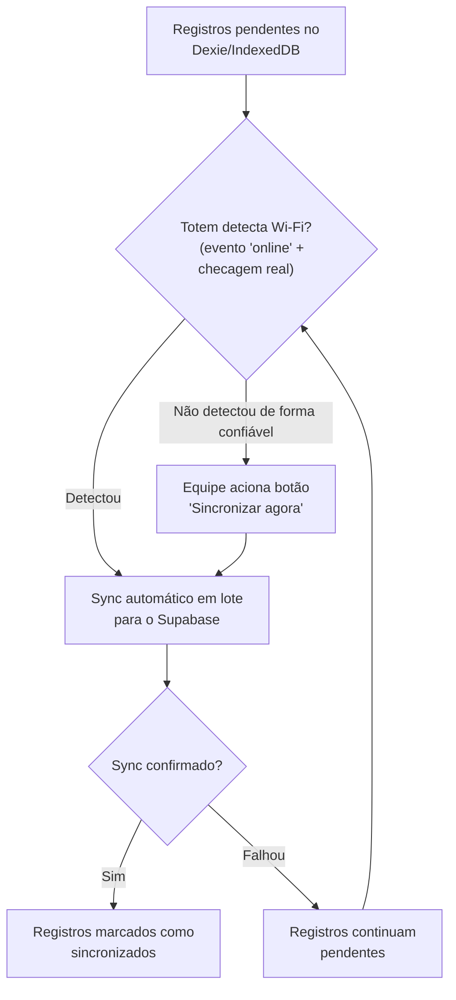
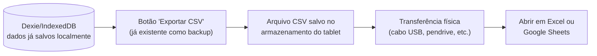

# Arquitetura Técnica

## Ponto de partida

O ponto de partida não é uma tela nova: é o código React da landing page
que o time de design/marketing já entrega pronta, feita no Lovable, com
[Supabase](https://supabase.com/docs) como back-end (o banco de dados na
nuvem que já guarda os dados da landing page online hoje, por trás da
tela que a pessoa vê). Esse código já vem ajustado para a resolução e
orientação do totem (retrato, tela alta e estreita, algo em torno de
1080×1920, a confirmar). O projeto aqui não é desenhar um formulário do
zero — é pegar esse React existente e fazer ele funcionar sem depender de
internet durante o evento.

No projeto Lovable já existe uma pasta `integrations/supabase` com
`client.ts`, `client.server.ts` e `types.ts` — esse último deve listar o
schema completo das tabelas, incluindo a de leads, que é a mesma tabela
que vai receber os dados sincronizados dos totens.

Os totens rodam Android 14 com o Google Chrome padrão (não é um app
nativo do fabricante do hardware). São 2 totens, mesmo código nos dois,
cada um com um `totem_id` fixo configurado na instalação para rastrear a
origem do lead e evitar conflito na hora de sincronizar.

## Duas opções técnicas

Avaliamos duas formas de fazer esse React existente funcionar offline.
**A recomendação é a Opção 1.**

### Opção 1 (recomendada): PWA sobre o código React existente

O código do Lovable vira um
[PWA](https://developer.mozilla.org/en-US/docs/Web/Progressive_web_apps)
(Progressive Web App — um site que se comporta como um aplicativo
instalado, inclusive funcionando sem internet): continua rodando dentro
do Chrome do Android, mas ganha uma camada de
[Service Worker](https://developer.mozilla.org/en-US/docs/Web/API/Service_Worker_API)
(um script que roda em segundo plano no navegador) que faz o cache
(guarda uma cópia local) de todos os assets estáticos (JS, CSS, imagens)
para carregar sem rede.

- **Armazenamento local:** [Dexie.js](https://dexie.org/docs/), um
  wrapper sobre [IndexedDB](https://developer.mozilla.org/en-US/docs/Web/API/IndexedDB_API)
  (um banco de dados que já vem embutido em qualquer navegador, usado
  para guardar informações direto no aparelho), em vez de IndexedDB
  puro — reduz boilerplate e risco de bug dado o prazo curto do
  projeto.
- **Sincronização:** envio em lote (batch — todos os registros de uma
  vez, em bloco, em vez de um por um) para o Supabase quando o
  totem detectar conexão, mais um botão manual de "sincronizar agora"
  como fallback — o evento `online` do navegador sozinho não é 100%
  confiável para detectar conectividade real. Esse é o Plano A de
  sincronização; para o cenário em que não há Wi-Fi disponível em
  nenhum momento, ver
  [Plano de contingência sem conectividade](#plano-de-contingência-sem-conectividade)
  logo abaixo.
- **Reset entre atendimentos:** já é resolvido pelo próprio fluxo da
  landing page, não pelo PWA. A pessoa completa o formulário, vê a tela
  final de prêmios, e a equipe de marketing aperta um botão de
  "recomeçar" (já existente na LP) que volta para a tela inicial. Não
  há reset automático por inatividade a implementar — isso é
  responsabilidade do fluxo já entregue pelo time de design, não deste
  projeto.
- **Bloqueio de tela:** **não é necessário.** A contratante confirmou
  que o totem terá sempre alguém da equipe de marketing por perto,
  controlando o reset entre atendimentos manualmente. Sem esse cenário
  de operação desassistida, nenhum lockdown de sistema (travar o tablet
  em modo totem, sem acesso a mais nada — via
  [Fully Kiosk Browser](https://www.fully-kiosk.com/en/) ou
  [Device Owner](https://developer.android.com/work/dpc/dedicated-devices/lock-task-mode))
  é requisito — rodar em modo normal do Chrome Android é suficiente.
  Detalhes da decisão em [Riscos e Contingência](/riscos-e-contingencia).

O diagrama abaixo resume esse fluxo geral, da captura no totem até o
ponto em que o sistema decide como os dados saem dali (Plano A ou
Plano B, detalhados mais adiante):

**Trade-offs:** reaproveita cerca de 95% do código existente sem mexer na
UI. Em compensação, qualquer rebuild/reexport feito no Lovable precisa
passar de novo pela camada de service worker antes de ir para o totem —
não é só recopiar os arquivos. Depurar cache de service worker em cima
de uma SPA React também exige disciplina de versionamento de cache
(cache antigo servindo tela desatualizada é a forma mais comum desse
tipo de bug).

### Opção 2 (alternativa): empacotamento nativo com Capacitor

O mesmo código React é empacotado como um app Android instalável
(`.apk` — o formato de arquivo instalável de aplicativos Android) via
[Capacitor](https://capacitorjs.com/docs) (uma ferramenta que empacota
um site feito em React como app nativo), com armazenamento local em
SQLite (um banco de dados local usado dentro de apps nativos, cumprindo
o mesmo papel que o IndexedDB cumpre no PWA), via o plugin
[capacitor-community/sqlite](https://github.com/capacitor-community/sqlite),
em vez de IndexedDB/Dexie, e sincronização em background quando detectar
internet.
Lockdown de sistema, se necessário no futuro, seria via
[Device Owner / Lock Task mode](https://developer.android.com/work/dpc/dedicated-devices/lock-task-mode).

**Trade-offs:** exige montar um pipeline de build Android (Android
Studio/Gradle) — complexidade nova para o prazo apertado do projeto. Como ficou
confirmado que o totem sempre vai ter supervisão humana (ver
[Riscos e Contingência](/riscos-e-contingencia)), o motivo original para
considerar essa opção — viabilizar lockdown via Device Owner — deixou de
se aplicar neste projeto. Ainda assim, a Opção 2 **continua
tecnicamente disponível** caso a contratante prefira, agora ou em
eventos futuros, um app nativo instalável em vez de um PWA — por
motivos como ícone na tela, sensação de "app de verdade", ou
gerenciamento do tablet como dispositivo dedicado. Isso é uma decisão
dela, não uma eliminação técnica da opção.

### Comparativo

| Critério | Opção 1 — PWA (recomendada) | Opção 2 — Capacitor (nativo) |
|---|---|---|
| Esforço no prazo do projeto | Baixo — reaproveita ~95% do código, sem novo pipeline de build | Alto — exige montar build Android (Android Studio/Gradle) do zero |
| Modificação do código existente | Mínima — camada de service worker + armazenamento, sem tocar na UI | Empacotamento completo do app; possível ajuste de APIs web → nativas |
| Armazenamento local | Dexie.js (IndexedDB) | SQLite |
| Risco de perda de dados | Baixo, mas depende de disciplina de versionamento de cache do service worker | Baixo — storage nativo mais previsível |
| Lockdown de tela suportado | [Fully Kiosk Browser](https://www.fully-kiosk.com/en/) (app de terceiros, licenciado) — não requisitado neste projeto | [Device Owner + Lock Task mode](https://developer.android.com/work/dpc/dedicated-devices/lock-task-mode) (nativo Android, mais robusto) — não requisitado neste projeto |
| Pré-requisito de provisionamento | Nenhum | Reset de fábrica dos tablets para configurar Device Owner |
| Quando compensa | Cenário recomendado para este prazo e operação (sempre supervisionado, reset manual pela equipe) | Se a contratante preferir app nativo instalável em vez de PWA — por motivos além de lockdown, como ícone na tela ou gestão como dispositivo dedicado |

## Plano de contingência sem conectividade

O Plano A cobre o caso comum: o totem pega Wi-Fi em algum momento do
evento e sincroniza com o Supabase. Mas o cenário mais pessimista
também precisa estar coberto — e se nenhum Wi-Fi estiver disponível
para o totem em momento nenhum, nem no fim do evento?

**Este Plano B não é a opção recomendada.** É a rede de segurança caso
o Plano A falhe ou não seja viável no dia — o Plano A continua sendo o
caminho preferido. E ele não exige nenhum código adicional além do que
já estava planejado: a captura em si não muda em nada, porque os dados
já são salvos localmente via Dexie/IndexedDB desde a Opção 1 (ver
diagrama acima), independente de rede. O que muda é só a saída — em vez
de ir pela rede até o Supabase, sai por um arquivo.

### Plano A: sincronização automática (Wi-Fi disponível)

Antes de contrastar com o Plano B, vale visualizar o fluxo completo do
Plano A, incluindo o botão manual como fallback dentro dele mesmo:

### Plano B: exportação CSV (sem Wi-Fi em nenhum momento)

O mesmo botão de exportar CSV (um arquivo de planilha simples, que abre
direto no Excel ou Google Sheets) que já estava planejado como backup
do Plano A é reaproveitado aqui — a diferença é só o destino do arquivo,
que sai por transferência física em vez de ir para o Supabase pela
rede:

Nenhuma etapa desse fluxo toca em rede ou no Supabase — é a opção
tecnicamente mais simples que existe, útil como garantia mesmo com o
Plano A sendo o preferido.

## Referências

- [PWA (Progressive Web Apps) — MDN](https://developer.mozilla.org/en-US/docs/Web/Progressive_web_apps)
- [Service Worker API — MDN](https://developer.mozilla.org/en-US/docs/Web/API/Service_Worker_API)
- [IndexedDB API — MDN](https://developer.mozilla.org/en-US/docs/Web/API/IndexedDB_API)
- [Dexie.js — documentação oficial](https://dexie.org/docs/)
- [Supabase — documentação oficial](https://supabase.com/docs)
- [Capacitor — documentação oficial](https://capacitorjs.com/docs)
- [capacitor-community/sqlite — plugin de SQLite para Capacitor](https://github.com/capacitor-community/sqlite)
- [Android Device Owner / Lock Task mode — developer.android.com](https://developer.android.com/work/dpc/dedicated-devices/lock-task-mode)
- [Fully Kiosk Browser — site oficial](https://www.fully-kiosk.com/en/)
