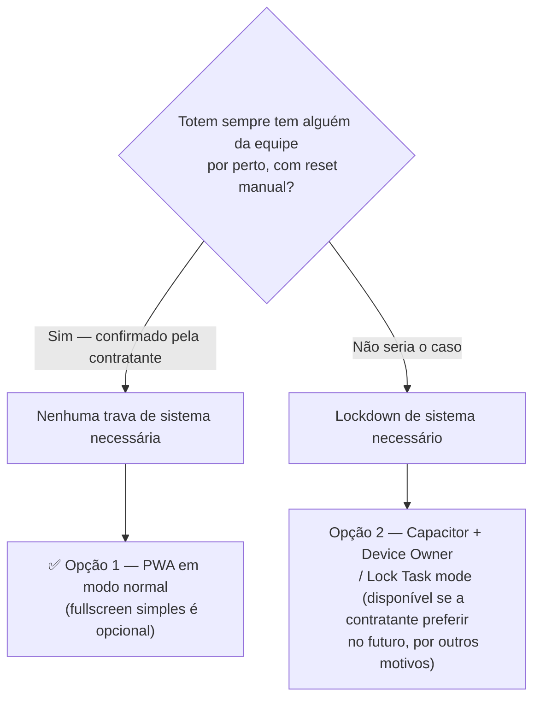

# Riscos e Contingência

## Decisão resolvida: lockdown / modo kiosk

A contratante confirmou como o totem vai operar: sempre com alguém da
equipe de marketing por perto. O fluxo real é assistido de ponta a
ponta — a pessoa completa o formulário, vê a tela final onde escolhe
prêmios (há uma ativação de comida com 4 carrinhos, e a pessoa ganha um
voucher para escolher duas opções), e depois alguém da equipe aperta um
botão de "recomeçar", já existente no fluxo da própria LP, que volta
para a tela inicial para atender a próxima pessoa da fila.

Como o reset entre atendimentos é manual, acionado por humano, e o
totem nunca fica sozinho, **nenhum bloqueio de sistema é necessário** —
nem [Fully Kiosk Browser](https://www.fully-kiosk.com/en/) (app de
terceiros que trava a tela do tablet em modo totem), nem
[Device Owner/Lock Task mode](https://developer.android.com/work/dpc/dedicated-devices/lock-task-mode)
(o mesmo tipo de trava, mas nativo do Android). O totem roda em modo
normal do Chrome Android. Um fullscreen simples (Immersive Mode — só
esconde a barra de status/navegação do Android, sem travar o tablet em
um único app; nativo e gratuito) é opcional, não obrigatório.

A foto abaixo é de um totem físico do mesmo formato/hardware, em
operação real, rodando **sem nenhum lockdown nem fullscreen** — a barra
de status do Android fica visível no topo. Ela é consistente com a
operação confirmada: esse tipo de solução funciona normalmente sem
nenhuma trava de sistema, desde que haja supervisão humana por perto,
como será o caso aqui.

*Totem de referência (outro cliente/evento), mostrando o formato físico
retrato e a barra de status do Android visível — evidência de que a
solução roda hoje sem nenhuma trava de sistema.*

O diagrama abaixo resume o raciocínio por trás dessa decisão — a
Opção 2 não foi eliminada tecnicamente, só deixou de ser necessária
para o cenário de operação confirmado:

Essa decisão também simplifica a arquitetura: a Opção 1 (PWA + Dexie.js)
resolve o projeto sozinha, sem precisar de nenhuma camada extra de
lockdown. A Opção 2 (Capacitor) continua documentada e tecnicamente
disponível em [Arquitetura Técnica](/arquitetura-tecnica), mas não por
motivo de lockdown — só se a contratante preferir um app nativo
instalável por outras razões, agora ou em eventos futuros.

## Outros riscos

| Risco | Impacto | Mitigação |
|---|---|---|
| Wi-Fi não disponível em nenhum momento do evento, nem no fim | Leads capturados ficam presos no totem | Plano B: exportação manual em CSV e transferência física (USB/pendrive) para Excel/Sheets — ver [Plano de contingência sem conectividade](/arquitetura-tecnica#plano-de-contingência-sem-conectividade) |
| Hardware ligado continuamente por ~2 dias de evento | Travamento, lentidão ou reinício inesperado do tablet perdendo estado da sessão | Persistência imediata de cada resposta no armazenamento local ([Dexie.js](https://dexie.org/docs/)/[IndexedDB](https://developer.mozilla.org/en-US/docs/Web/API/IndexedDB_API), o banco de dados embutido no navegador que guarda os dados direto no tablet) e checagem de estabilidade nos testes em hardware físico antes do evento |
| Rebuild/reexport do código no Lovable depois que o service worker já estiver configurado | Nova versão da LP ir para o totem sem passar pela camada offline, quebrando o cache ou perdendo o ajuste offline | Processo definido de que todo novo build do Lovable passa pela camada de service worker antes de ir para o totem — não é uma simples recópia de arquivos |
| Cache do service worker desatualizado (bug comum em PWA sobre SPA React) | Totem mostrar tela antiga mesmo após atualização do código | Disciplina de versionamento de cache no service worker |
| Time do Lovable ainda ajustando o formulário final, sem ETA confirmado | Pode atrasar a integração da camada offline com o código definitivo | Ver detalhamento e plano de contingência em [Plano de Implementação e Cronograma](/plano-e-cronograma) |

## Referências

- [Fully Kiosk Browser — site oficial](https://www.fully-kiosk.com/en/)
- [Android Device Owner / Lock Task mode — developer.android.com](https://developer.android.com/work/dpc/dedicated-devices/lock-task-mode)
- [Dexie.js — documentação oficial](https://dexie.org/docs/)
- [IndexedDB API — MDN](https://developer.mozilla.org/en-US/docs/Web/API/IndexedDB_API)
