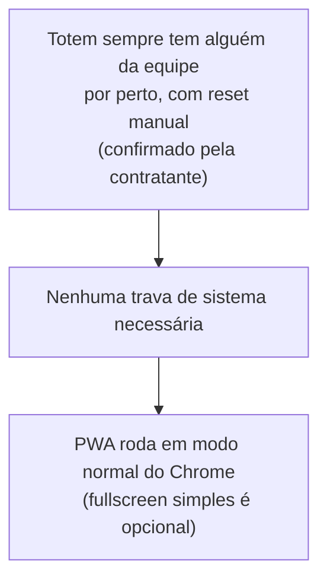

# Riscos e Contingência

## Decisão resolvida: lockdown / modo kiosk

A contratante confirmou como o totem vai operar: sempre com alguém da
equipe de marketing por perto. O fluxo real é assistido de ponta a
ponta — a pessoa completa o formulário, vê a tela final onde escolhe
prêmios (há uma ativação de comida com 4 carrinhos, e a pessoa ganha um
voucher para escolher duas opções), e depois alguém da equipe aperta um
botão de "recomeçar", já existente no fluxo da própria LP, que volta
para a tela inicial para atender a próxima pessoa da fila.

Como o reset entre atendimentos é manual, acionado por humano, e o
totem nunca fica sozinho, **nenhum bloqueio de sistema é necessário** —
nem [Fully Kiosk Browser](https://www.fully-kiosk.com/en/) (app de
terceiros que trava a tela do tablet em modo totem), nem nenhum outro
mecanismo de lockdown. O totem roda em modo normal do Chrome Android.
Um fullscreen simples (Immersive Mode — só esconde a barra de
status/navegação do Android, sem travar o tablet em um único app;
nativo e gratuito) é opcional, não obrigatório.

A foto abaixo é de um totem físico do mesmo formato/hardware, em
operação real, rodando **sem nenhum lockdown nem fullscreen** — a barra
de status do Android fica visível no topo. Ela é consistente com a
operação confirmada: esse tipo de solução funciona normalmente sem
nenhuma trava de sistema, desde que haja supervisão humana por perto,
como será o caso aqui.

*Totem de referência (outro cliente/evento), mostrando o formato físico
retrato e a barra de status do Android visível — evidência de que a
solução roda hoje sem nenhuma trava de sistema.*

O diagrama abaixo resume o raciocínio por trás dessa decisão:

Essa decisão também simplifica a arquitetura: o PWA (ver
[Arquitetura Técnica](/arquitetura-tecnica)) resolve o projeto sozinho,
sem precisar de nenhuma camada extra de lockdown nem de empacotamento
nativo — por isso a proposta documenta uma única abordagem técnica, não
duas opções para comparar.

## Decisão resolvida: sincronização 100% offline

A equipe de marketing avaliou a proposta inicial (sincronização
automática com o Supabase quando o totem pegasse Wi-Fi, com exportação
CSV como rede de segurança) e preferiu simplificar: manter a operação
**100% offline**, em vez de deixar qualquer parte do fluxo dependendo
de conectividade, mesmo que só ao final do evento.

Na prática, isso inverte as prioridades da versão anterior desta
proposta — o que era rede de segurança vira o método único:

- **Sem sincronização automática via Wi-Fi.** O totem nunca tenta se
  conectar ao Supabase pela rede. Isso elimina de vez o risco de Wi-Fi
  indisponível no fim do evento (não é mais um risco, porque a operação
  nunca dependeu disso).
- **Exportação CSV + transferência física (pendrive ou cabo USB) como
  único método** de tirar os leads do totem, com importação manual no
  Supabase ou em uma planilha depois do evento.
- **Simplifica a stack e o cronograma:** sem checagem de conectividade,
  sem lógica de retry de sincronização, sem estado de "pendente vs.
  sincronizado" para gerenciar e testar.

Detalhes técnicos do fluxo (diagrama incluído) estão em
[Arquitetura Técnica](/arquitetura-tecnica#como-os-dados-saem-do-totem)
e [Stack e Decisões Técnicas](/stack-e-decisoes-tecnicas#saída-de-dados).

## Outros riscos

| Risco | Impacto | Mitigação |
|---|---|---|
| Totem físico sem porta USB acessível para conectar o pendrive | Não dá para tirar o CSV do tablet no dia | Confirmar com a contratante, antes do evento, que os totens têm porta USB-C (ou micro-USB) acessível — ver [Como os dados saem do totem](/arquitetura-tecnica#como-os-dados-saem-do-totem) |
| Hardware ligado continuamente por ~2 dias de evento | Travamento, lentidão ou reinício inesperado do tablet perdendo estado da sessão | Persistência imediata de cada resposta no armazenamento local ([Dexie.js](https://dexie.org/docs/)/[IndexedDB](https://developer.mozilla.org/en-US/docs/Web/API/IndexedDB_API), o banco de dados embutido no navegador que guarda os dados direto no tablet) e checagem de estabilidade nos testes em hardware físico antes do evento |
| Rebuild/reexport do código no Lovable depois que o service worker já estiver configurado | Nova versão da LP ir para o totem sem passar pela camada offline, quebrando o cache ou perdendo o ajuste offline | Processo definido de que todo novo build do Lovable passa pela camada de service worker antes de ir para o totem — não é uma simples recópia de arquivos |
| Cache do service worker desatualizado (bug comum em PWA sobre SPA React) | Totem mostrar tela antiga mesmo após atualização do código | Disciplina de versionamento de cache no service worker |
| Time do Lovable ainda ajustando o formulário final, sem ETA confirmado | Pode atrasar a integração da camada offline com o código definitivo | Ver detalhamento e plano de contingência em [Plano de Implementação e Cronograma](/plano-e-cronograma) |

## Referências

- [Fully Kiosk Browser — site oficial](https://www.fully-kiosk.com/en/)
- [Dexie.js — documentação oficial](https://dexie.org/docs/)
- [IndexedDB API — MDN](https://developer.mozilla.org/en-US/docs/Web/API/IndexedDB_API)
