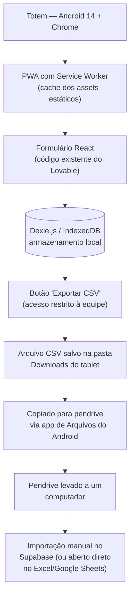

# Arquitetura Técnica

## Ponto de partida

O ponto de partida não é uma tela nova: é o código React da landing page
que o time de design/marketing já entrega pronta, feita no Lovable, com
[Supabase](https://supabase.com/docs) como back-end (o banco de dados na
nuvem que já guarda os dados da landing page online hoje, por trás da
tela que a pessoa vê). Esse código já vem ajustado para a resolução e
orientação do totem (retrato, tela alta e estreita, algo em torno de
1080×1920, a confirmar). O projeto aqui não é desenhar um formulário do
zero — é pegar esse React existente e fazer ele funcionar sem depender de
internet durante o evento.

No projeto Lovable já existe uma pasta `integrations/supabase` com
`client.ts`, `client.server.ts` e `types.ts` — esse último deve listar o
schema completo das tabelas, incluindo a de leads, que é a mesma tabela
que vai receber os dados dos totens depois da importação manual do CSV
exportado (ver [Como os dados saem do totem](#como-os-dados-saem-do-totem)
abaixo — a contratante confirmou operação 100% offline, sem
sincronização automática via rede).

Os totens rodam Android 14 com o Google Chrome padrão (não é um app
nativo do fabricante do hardware). São 2 totens, mesmo código nos dois,
cada um com um `totem_id` fixo configurado na instalação para rastrear a
origem do lead e evitar ambiguidade na hora de juntar os CSVs exportados
dos dois totens.

## Como funciona

O código do Lovable vira um
[PWA](https://developer.mozilla.org/en-US/docs/Web/Progressive_web_apps)
(Progressive Web App — um site que se comporta como um aplicativo
instalado, inclusive funcionando sem internet): continua rodando dentro
do Chrome do Android, mas ganha uma camada de
[Service Worker](https://developer.mozilla.org/en-US/docs/Web/API/Service_Worker_API)
(um script que roda em segundo plano no navegador) que faz o cache
(guarda uma cópia local) de todos os assets estáticos (JS, CSS, imagens)
para carregar sem rede.

- **Armazenamento local:** [Dexie.js](https://dexie.org/docs/), um
  wrapper sobre [IndexedDB](https://developer.mozilla.org/en-US/docs/Web/API/IndexedDB_API)
  (um banco de dados que já vem embutido em qualquer navegador, usado
  para guardar informações direto no aparelho), em vez de IndexedDB
  puro — reduz boilerplate e risco de bug dado o prazo curto do
  projeto.
- **Saída de dados:** exportação em CSV e transferência física — **não
  há sincronização automática via Wi-Fi com o Supabase.** A contratante
  confirmou preferência por operação 100% offline, em vez de depender
  de conexão em qualquer momento do evento. O passo a passo completo
  está em [Como os dados saem do totem](#como-os-dados-saem-do-totem),
  logo abaixo.
- **Reset entre atendimentos:** já é resolvido pelo próprio fluxo da
  landing page, não pelo PWA. A pessoa completa o formulário, vê a tela
  final de prêmios, e a equipe de marketing aperta um botão de
  "recomeçar" (já existente na LP) que volta para a tela inicial. Não
  há reset automático por inatividade a implementar — isso é
  responsabilidade do fluxo já entregue pelo time de design, não deste
  projeto.
- **Bloqueio de tela:** **não é necessário.** A contratante confirmou
  que o totem terá sempre alguém da equipe de marketing por perto,
  controlando o reset entre atendimentos manualmente. Sem esse cenário
  de operação desassistida, nenhum lockdown de sistema (travar o tablet
  em modo totem, sem acesso a mais nada — via
  [Fully Kiosk Browser](https://www.fully-kiosk.com/en/), por exemplo)
  é requisito — rodar em modo normal do Chrome Android é suficiente.
  Detalhes da decisão em [Riscos e Contingência](/riscos-e-contingencia).

O diagrama abaixo resume o fluxo completo, da captura no totem até a
importação manual no destino final — nenhuma etapa toca em rede:

**Trade-offs:** reaproveita cerca de 95% do código existente sem mexer na
UI. Em compensação, qualquer rebuild/reexport feito no Lovable precisa
passar de novo pela camada de service worker antes de ir para o totem —
não é só recopiar os arquivos. Depurar cache de service worker em cima
de uma SPA React também exige disciplina de versionamento de cache
(cache antigo servindo tela desatualizada é a forma mais comum desse
tipo de bug).

## Como os dados saem do totem

A contratante confirmou preferência por operação 100% offline (ver
[Riscos e Contingência](/riscos-e-contingencia) para a decisão
completa) — o totem nunca tenta se conectar a nada pela rede. A saída
dos dados é sempre manual, feita pela equipe, em duas partes: primeiro
tirar o CSV de dentro do totem, depois levar esse arquivo até um
computador.

### 1. Gerar o arquivo CSV no totem

Um botão discreto de exportação — no mesmo padrão do botão de
"recomeçar" que já existe no código da LP (aperta e segura por ~1,5s,
para não ser acionado sem querer pelo público) — fica disponível nos
dois totens, fora da visão/alcance do fluxo normal do visitante.

Ao ser acionado:

1. O app lê todos os registros daquele totem salvos no Dexie/IndexedDB.
2. Monta um arquivo CSV com as colunas equivalentes à tabela de leads
   do Supabase, incluindo o `totem_id` em cada linha.
3. O Chrome Android salva esse arquivo automaticamente na pasta
   **Downloads** do tablet — comportamento padrão do navegador para
   qualquer download, sem precisar de nenhuma permissão especial.

O nome do arquivo inclui o `totem_id` e a data (ex:
`leads_totem-1_2026-09-18.csv`), para não misturar os dois totens na
hora de juntar tudo depois.

### 2. Levar o arquivo até um computador

1. A equipe conecta um pendrive ao totem — via USB-C direto, ou com um
   adaptador OTG (USB-C para USB-A) se o pendrive for do tipo comum.
   **Isso depende do totem físico ter uma porta USB acessível** — é uma
   premissa a confirmar com a contratante (ver
   [Riscos e Contingência](/riscos-e-contingencia)).
2. Abre o app de **Arquivos** nativo do Android (vem instalado de
   fábrica em qualquer Android 14), que enxerga tanto o armazenamento
   interno do tablet quanto o pendrive conectado.
3. Localiza o CSV na pasta Downloads e copia para o pendrive.
4. Repete esse processo nos dois totens — resultando em dois arquivos
   CSV separados, um por totem.

### 3. Importar os dados

Com os dois CSVs em mãos, a equipe leva o pendrive até um computador e
tem duas opções, sem precisar de nenhum código adicional:

- **Abrir direto** no Excel ou Google Sheets, para conferência rápida
  ou uso imediato.
- **Importar no Supabase**, usando a função nativa de importação de CSV
  do [Supabase Studio](https://supabase.com/docs/guides/database/import-data)
  (o painel web do Supabase) direto na tabela de leads existente — sem
  precisar escrever nenhum script, mesma tabela que a LP online já usa.

Nenhuma etapa desse fluxo toca em rede — é a opção tecnicamente mais
simples que existe: sem checagem de conectividade, sem lógica de retry,
sem estado de "pendente vs. sincronizado" para gerenciar ou depurar.

## Referências

- [PWA (Progressive Web Apps) — MDN](https://developer.mozilla.org/en-US/docs/Web/Progressive_web_apps)
- [Service Worker API — MDN](https://developer.mozilla.org/en-US/docs/Web/API/Service_Worker_API)
- [IndexedDB API — MDN](https://developer.mozilla.org/en-US/docs/Web/API/IndexedDB_API)
- [Dexie.js — documentação oficial](https://dexie.org/docs/)
- [Supabase — documentação oficial](https://supabase.com/docs)
- [Importação de dados via CSV no Supabase](https://supabase.com/docs/guides/database/import-data)
- [Fully Kiosk Browser — site oficial](https://www.fully-kiosk.com/en/)
