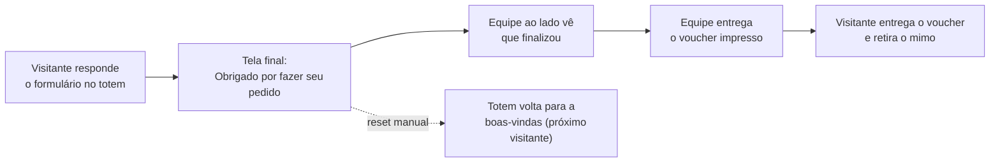

# Design e Ergonomia do Totem

Este documento reúne o que já sabemos sobre o totem físico e sobre a
jornada da v2 da landing page (LP), e traz uma contribuição de design e
ergonomia para o time de design/marketing avaliar: onde cada elemento
está hoje na tela, onde ele deveria estar para o visitante tocar com
conforto, e por quê.

São **recomendações**, não mudança de escopo: o escopo desta proposta
continua sendo fazer o código da LP funcionar offline, e o redesenho da
LP segue fora dele (ver [Escopo](/escopo)).

:::note Como ler os números
O tamanho do totem e da tela vem do desenho técnico (seção 1). A única
medida que falta é a distância do chão até a borda de baixo da tela: hoje
ela é **estimada** (ver [Pendências](#10-pendências)). Quando for
confirmada, basta trocar essa premissa e refazer as contas — o método
está descrito na seção 3.
:::

## 1. O que é confirmado, o que é estimativa e o que falta

| Item | Situação | O que sabemos |
|---|---|---|
| Resolução da tela | Confirmado | 1080×1920 pixels, em pé (retrato). É a resolução oficial do totem. |
| Tamanho do totem | Confirmado | Desenho técnico abaixo: 1800 mm de altura total e 624 mm de largura do corpo. |
| Tela | Confirmado | 43 polegadas, área ativa de 530 × 942 mm. A proporção é 9:16, a mesma de 1080×1920. |
| Tamanho físico de cada pixel | Confirmado | ≈ 0,49 mm por pixel (942 mm ÷ 1920 px), ou ≈ 52 pixels por polegada. Vale se o navegador enxergar mesmo 1080 pixels de largura (ver [Pendências](#10-pendências)). |
| Onde a tela fica em relação ao chão | **Estimado** | O desenho não indica a distância do chão até a tela. Pela proporção do desenho (moldura de cima parecida com a lateral, ≈ 4,7 cm), a tela vai de **≈ 81 a ≈ 175 cm do piso**. Como o topo não passa de ≈ 175 cm (a moldura de cima existe), o erro possível é só para baixo: a borda de baixo pode estar até ≈ 7 cm mais baixa (≈ 74 cm). O resto do corpo é um painel preto sem tela e a base (≈ 10 cm). |
| Sistema do totem | Confirmado | Android 14 com Chrome padrão, sem modo kiosk (ver [Riscos e Contingência](/riscos-e-contingencia)). Na foto de referência, a barra de status do Android aparece no topo da tela. |
| Operação | Confirmado | Sempre há alguém da equipe ao lado do totem. |
| Estatura do público | Referência | Média brasileira: mulheres 160,9 cm e homens 173,6 cm (ver seção 4). |

*Desenho técnico do totem (medidas em mm): 1800 de altura, 624 de largura,
tela de 43 polegadas com 530 × 942.*

Um esclarecimento sobre a documentação da v2: um arquivo de plano do
projeto Lovable menciona validação em "1280×800, tablet horizontal".
Isso é resquício de uma versão anterior, que não levava em conta o
hardware do totem, e deve ser ignorado. A referência é sempre 1080×1920.

## 2. A jornada do visitante na v2

São 13 telas, na ordem em que o visitante as vê:

1. **Boas-vindas** — "Faça seu pedido aqui / toque na tela para começar" (a tela inteira é área de toque).
2. **Nome** — campo de texto.
3. **Intro** — "*Nome*, está na hora de saborear boas experiências", botão Avançar.
4. **Pergunta 1** — plataforma de atendimento (4 opções; "Outra plataforma" abre um campo de texto).
5. **Pergunta 2** — modelo de atendimento (3 opções).
6. **Empresa** — campo de texto.
7. **Pergunta 3** — evolução da tecnologia (4 opções).
8. **Cargo** — 4 opções.
9. **Pergunta 4** — onde o atendimento trava (4 opções).
10. **Pergunta 5** — tamanho da empresa (4 opções).
11. **Contato** — e-mail corporativo e WhatsApp (2 campos).
12. **Consentimento** — aceite da Política de Privacidade.
13. **Voucher** — tela final "Obrigado por fazer seu pedido", com 3 passos e o botão Encerrar.

### Como o voucher funciona (alinhado com a equipe)

A última tela é o fim da jornada: não há mais nenhuma lógica depois dela.
A pessoa da equipe que está ao lado do totem vê que o visitante finalizou
o formulário e entrega o voucher impresso; o visitante entrega o voucher
e retira o mimo.

Duas consequências para o design:

- **A tela final também é um sinal para a equipe.** Ela precisa ser
  reconhecível de longe (título grande, no nível dos olhos, cor forte),
  não só legível para quem está de frente.
- **Quem toca em "Encerrar"?** O botão volta o totem para a
  boas-vindas. Se o visitante tocar nele antes de a equipe olhar para a
  tela, o sinal de "finalizou" some. Vale decidir se o botão fica para o
  visitante, se fica só com a equipe (o botão oculto de reset já existe)
  ou se a tela fica visível por um tempo mínimo.

Para o time técnico: hoje a tela final só aparece depois que o envio ao
Supabase responde; na operação offline, o salvamento local (Dexie) precisa
ocupar esse lugar (ver [Arquitetura Técnica](/arquitetura-tecnica)).

## 3. Onde cada elemento está hoje (medido no app real)

**Método.** Rodei a v2 no Chrome em 1080×1920 pixels (escala 1:1, como no
totem), percorri as 13 telas e medi a caixa de cada elemento. Depois
converti pixels em centímetros do piso com as premissas da seção 1:

- a tela tem 1920 px para 942 mm de altura, então **1 cm ≈ 20,4 px** e
  **1 px ≈ 0,49 mm** (medida do desenho técnico);
- a tela vai de ≈ 81 a ≈ 175 cm do piso (estimativa da seção 1), então a
  altura do piso de um ponto que está a *y* pixels do topo da tela é
  175,2 − *y* ÷ 20,4.

Como as imagens (logo e foto dos mimos) só existem no Lovable, usei
espaços reservados com o tamanho máximo que o código permite.

| Tela | Elemento | Altura do piso (cm) | Tamanho (mm) |
|---|---|---|---|
| Boas-vindas | Toque em qualquer ponto (imagem, título e texto) | 169 → 140 | tela toda |
| Nome / Empresa | Campo de texto | 166 → 162 | 330 × 32 |
| Nome / Empresa | Continuar | 162 → 159 | 330 × 29 |
| Intro | Avançar | 157 → 154 | 377 × 35 |
| Perguntas de 4 opções | 2 linhas de 2 botões | 163 → 151 | 212 × 55 (cada) |
| Pergunta de 3 opções | 3 botões em coluna | 163 → 145 | 432 × 55 (cada) |
| Pergunta 1, "Outra plataforma" | Campo e Continuar | 151 → 148 | 250 × 26 e 74 × 26 |
| Cargo | 4 botões (2 × 2) | 166 → 158 | 213 × 33 (cada) |
| Contato | 2 campos | 163 → 160 | 184 × 30 (cada) |
| Contato | Continuar | 159 → 156 | 377 × 29 |
| Consentimento | Quadradinho de aceite | 162 → 160 | 16 × 16 |
| Consentimento | Link "Política de Privacidade" | 160 → 159 | 103 × 14 |
| Consentimento | Ver meus vouchers | 157 → 154 | 330 × 29 |
| Voucher | Encerrar | 136 → 133 | 377 × 29 |
| Todas (menos boas-vindas e voucher) | Voltar | 174 → 172 | 22 × 22 |
| Todas | Logo fixa (sem toque) | 89 → 83 | 235 × 55 |
| Todas | Reset da equipe (invisível) | 84 → 82 | 20 × 20 |

**O que os números mostram**

- **O conteúdo interativo ocupa só os primeiros 45% da altura da tela**
  (até ≈ 133 cm do piso, no pior caso, o botão Encerrar). Abaixo de
  120 cm — os 41% de baixo da tela — só existe a logo.
- **Nenhum controle está na faixa de 80 a 120 cm** que a norma
  brasileira de acessibilidade pede (seção 4). A maioria fica entre 145 e
  166 cm — perto da altura dos olhos, não da altura confortável para
  tocar. Como a tela só desce até ≈ 81 cm, tudo o que está abaixo de
  120 cm na tela está dentro da norma, e está vazio.
- **Voltar está a ≈ 172–174 cm**, praticamente no topo do totem: acima da
  cabeça da mulher média (161 cm) e na altura do topo da cabeça do homem
  médio. Na prática, a maioria das pessoas não alcança.
- **O tamanho dos alvos não é o problema.** Os botões de resposta têm
  55 mm de altura. Os menores alvos relevantes são o link de privacidade
  (14 mm de altura), o quadradinho de aceite (16 mm), o reset da equipe
  (20 mm) e o Voltar (22 mm) — todos acima dos ≈ 9 mm de referência de
  mercado. O que pesa é a **posição**.

## 4. Referências: corpo humano e normas

### Medidas do corpo (público brasileiro)

| Referência | Estatura | Olhos | Ombro | Cotovelo |
|---|---|---|---|---|
| Mulher, 5º percentil (aprox.) | 150 cm | 141 cm | 123 cm | 95 cm |
| **Mulher média** | **161 cm** | **151 cm** | **132 cm** | **101 cm** |
| **Homem médio** | **174 cm** | **163 cm** | **142 cm** | **109 cm** |
| Homem, 95º percentil (aprox.) | 185 cm | 173 cm | 151 cm | 117 cm |

- **Médias:** 160,9 cm (mulheres) e 173,6 cm (homens), coorte de 1996,
  [NCD-RisC](https://elifesciences.org/articles/13410). Eu não consegui
  confirmar esses valores na tabela original do IBGE; fontes secundárias
  citam valores próximos (≈ 1,61 m e ≈ 1,73 m).
- **Percentis 5 e 95:** aproximação nossa (média ∓ 1,645 desvio-padrão,
  assumindo ≈ 6,5 a 7 cm). Servem para mostrar os extremos, não são dado
  oficial.
- **Olhos, ombro e cotovelo:** proporções clássicas da estatura
  (0,936 / 0,818 / 0,630), de [Drillis e Contini](https://www.openlab.psu.edu/design-tools-proportionality-constants/)
  (1966) — muito usadas em ergonomia, mas com limitações conhecidas.
- Sapatos e salto somam alguns centímetros; em feira, considere +2 a +4 cm.

### Normas e guias de conforto

- **[ABNT NBR 9050:2020](https://www.ufsm.br/app/uploads/sites/391/2020/08/ABNT-NBR-9050-.pdf), item 9.4.3.5** (máquinas de autoatendimento): os controles devem ficar
  **entre 0,80 m e 1,20 m do piso**, com no máximo 0,30 m de
  profundidade em relação à face frontal. O item 9.4.3.3 pede local bem
  iluminado e protegido da luz ambiente, para evitar reflexos.
- **NBR 9050:2020, item 4.6.1** (alcance manual frontal, pessoa em pé):
  com o antebraço a 90°, a mão fica a 0,90–1,00 m; com o braço na
  horizontal, a 1,15–1,25 m; alcance máximo confortável (braço a 45°):
  1,40–1,55 m. Para cadeirante, o alcance máximo confortável é 1,20 m.
- **NBR 9050:2020, item 4.8.2:** a linha de visão considerada é de 1,40–1,50 m
  para quem está em pé e de 1,10–1,20 m para quem está em cadeira de rodas.
- **[Ergonomics of Touch Screens](https://spacepole.com/files/files/website%20content/insights/workplace%20ergonomics/es-whitepaper-ergonomics-of-touchscreens-en-2022.pdf)
  (Ergonomic Solutions, 2019):** uma tela de toque na altura dos olhos fica
  alta demais para toque frequente (cansaço de ombro e braço); em pé, a
  faixa recomendada de montagem é 1,05–1,40 m; em acesso público, para
  cadeirantes, 0,80–1,20 m; o olhar confortável fica 30° ± 15° para
  baixo; telas LCD distorcem imagem e cor quando vistas a mais de 15–20°
  fora do eixo.
- **Alvos de toque:** referência comum de mercado de ≈ 9 mm (Google
  Material 48 dp, Apple 44 pt). O [WCAG 2.2](https://www.w3.org/TR/WCAG22/)
  pede no mínimo 24 px (AA) e recomenda 44 px (AAA) em telas comuns.

## 5. Mapa de zonas do totem

Com a tela de ≈ 81 a ≈ 175 cm e as referências acima, o totem se divide
assim:

| Faixa (cm do piso) | Posição na tela (px do topo) | Para que usar |
|---|---|---|
| Acima de 150 | 0 a 514 | **Marca e atração.** Acima do olho da mulher média; é a parte que se enxerga de longe e por cima da fila. Sem toque. |
| 150 a 120 | 514 a 1125 | **Leitura.** Título, instruções, progresso. Olhar levemente para baixo (confortável). Toque só como reforço. |
| **120 a 90** | **1125 a 1737** | **Toque ideal.** Botões, campos e botões de continuar. Entre o cotovelo e o ombro da maioria; dentro da NBR 9050. Prefira a metade de cima (≈ 100–120 cm), onde o olhar ainda é confortável. |
| 90 a 81 (base da tela) | 1737 a 1920 | **Rodapé.** Toque aceitável para ações secundárias, mas o rodapé fica na altura do quadril: melhor para informação estática. |

A norma pede controles entre 80 e 120 cm. Como a tela só chega a ≈ 81 cm,
todo o trecho abaixo de 120 cm está dentro dela.

Tem também um limite de visão. O olhar confortável fica até ≈ 45° para
baixo, e a 50 cm de distância isso corresponde a controles a partir de
≈ 100 cm para a mulher média e ≈ 112 cm para o homem médio; a 90 cm o
olhar já vai a ≈ 50–55° para baixo. Por isso o texto importante fica na
zona de leitura, só os controles descem, e dentro da faixa de toque o
melhor é usar a metade de cima (≈ 100–120 cm).

## 6. Reavaliação: hoje × proposta

As figuras comparam a posição real de hoje com uma **proposta só de
reposicionamento** (mesmo visual, mesmos tamanhos): o bloco de conteúdo
desce, o "Voltar" vai para a zona de toque e a marca sobe. A faixa azul é
a zona ideal de toque; as linhas tracejadas são os olhos da mulher e do
homem médios.

Com a proposta, todos os controles ficam entre **≈ 99 e 120 cm** do piso
(o primeiro botão em ≈ 117–120 cm e o último em ≈ 99–103 cm) e o Voltar
em ≈ 93–97 cm. O tamanho dos alvos não muda, exceto o Voltar, que cresce.

## 7. Recomendações (em ordem de prioridade)

**Posição — o que mais pesa**

1. **Descer o bloco de conteúdo.** O primeiro controle deve começar em
   ≈ 1130–1200 px (≈ 120–116 cm) e o último terminar, de preferência, até
   ≈ 1560 px (≈ 100 cm), sem passar de ≈ 1740 px (≈ 90 cm). No código, o contêiner do conteúdo (`items-start` com
   `lg:pt-[3vh]`, em `src/routes/index.tsx`) passaria a ≈ `lg:pt-[52vh]`;
   o valor final deve ser ajustado depois do teste no aparelho real.
   Não se aplica à boas-vindas (toque em qualquer ponto) nem ao voucher,
   que precisam de tratamento próprio.
2. **Levar o "Voltar" para a zona de toque** (≈ 93–97 cm) e aumentar
   de 44 px (22 mm) para ≈ 72 px (35 mm).
3. **Subir a marca e a imagem principal** para acima de 150 cm. A logo no
   rodapé (≈ 83–89 cm) fica atrás da fila e na altura do quadril; no topo
   (≈ 162–168 cm), é vista de longe e por cima das pessoas.
4. **Voucher:** título e 3 passos na zona de leitura (≈ 150 → 137 cm) e
   o botão Encerrar na zona de toque (≈ 114–117 cm). Ver a discussão de
   "quem toca em Encerrar" na seção 2.

**Usabilidade**

5. **Consentimento: o cartão inteiro deve marcar o aceite.** Hoje só o
   quadradinho de 16 mm marca; o cartão inteiro parece um botão, mas o
   toque no texto não faz nada.
6. **Padronizar a altura dos botões.** As perguntas usam botões de 55 mm
   de altura e o cargo 33 mm.
7. **Voltar a mostrar o progresso.** A v1 tinha barra e contador; a v2
   removeu, e são 11 telas até o voucher. Um indicador discreto (pontos
   ou barra) na zona de leitura resolve.
8. **Padronizar o verbo do botão:** "Avançar" na intro e "Continuar" nas
   demais.
9. **Botão desabilitado e placeholder mais legíveis.** O botão desabilitado
   (35% de opacidade) tem contraste de 2,4:1 com o fundo e não diz por que
   está apagado; o placeholder tem 3,4:1. Sob o reflexo do vidro (visível na
   foto de referência), tendem a sumir. Uma mensagem curta ("digite um
   e-mail válido") e placeholder ≥ 4,5:1 ajudam.

**Teclado e entrada de texto**

10. **Campo e botão de continuar terminando até ≈ 1300 px** (≈ 111 cm),
    deixando ≥ 30% da tela livre para o teclado do Android. O caso mais
    sensível é o campo de "Outra plataforma", que fica mais baixo (até
    ≈ 1490 px). A altura real do teclado depende da escala do aparelho —
    só o teste no totem responde.
11. **Reduzir digitação onde der:** máscara no WhatsApp e sugestão de
    domínio no e-mail.
12. **Teclado próprio não é necessário.** O teclado do Android ocupa a
    base da tela, a partir de ≈ 81 cm; com 300 a 600 px de altura ele sobe
    até ≈ 96–110 cm. É a altura do cotovelo, boa para digitar. O que
    importa é que campos e botões fiquem acima dele (recomendação 10).

**Operação**

13. **Tela final como sinal para a equipe** (seção 2).
14. **Tela cheia (Immersive Mode).** A proposta já trata como opcional; aqui
    passa a ser recomendado: a barra de status (≈ 1,2 cm) e, se a página
    não estiver instalada como PWA, a barra de endereço do Chrome (≈ 2,7 cm)
    comem altura útil e empurram tudo para baixo.

**Leitura**

15. **Aumentar os rótulos pequenos.** Os rótulos do contato ("E-mail
    corporativo", "WhatsApp") têm 12 px, ≈ 6 mm de corpo de letra, no
    limite do confortável para ler a 60 cm. Subir para 14–16 px dá folga.

## 8. Heurísticas de usabilidade aplicadas

| Heurística | Situação na v2 | Sugestão |
|---|---|---|
| Visibilidade do estado do sistema (Nielsen) | Sem indicador de progresso; a v1 tinha "leva de 1 a 3 minutos". | Recomendação 7. |
| Consistência e padrões | "Avançar" × "Continuar"; botões de 33 mm × 55 mm. | Recomendações 6 e 8. |
| Prevenção e recuperação de erros | Botão apagado sem explicação. | Recomendação 9. |
| Reconhecimento em vez de memorização | Bom: opções sempre visíveis, uma pergunta por tela. | Manter. |
| Lei de Hick (quantidade de escolhas) | Bom: 3 ou 4 opções por pergunta. | Manter. |
| Lei de Fitts (tamanho e distância do alvo) | Alvos grandes (bom), mas "Voltar" é pequeno e está longe. | Recomendação 2. |
| Proximidade (Gestalt) | Título e opções agrupados. | Manter o agrupamento ao descer o bloco. |
| Legibilidade sob reflexo | Texto principal 18:1 e secundário 8:1 (ótimos); placeholder 3,4:1. | Recomendação 9. |
| Privacidade em espaço público | E-mail e WhatsApp aparecem em letra grande, legíveis por quem está na fila. | Anotar; avaliar com o time de marketing. |

## 9. Ambiente do totem: o que ainda precisa de teste

- **Escala do Android (o risco mais importante).** Uma tela de 1080×1920
  pixels não garante que o navegador enxergue 1080 de largura: o Android
  divide pela densidade configurada. Se estiver em 2×, por exemplo, o
  navegador enxerga 540×960 e o layout cai na versão de celular, com tudo
  ≈ 2× maior do que o simulado. Só se descobre abrindo a página no aparelho.
- **Barras na tela.** Na foto de referência a barra de status aparece no
  topo. Sem tela cheia, ela (e a barra do Chrome, se a página não for um
  PWA instalado) reduz a altura útil.
- **Teclado.** Aparece por padrão em campos de texto no Android 14;
  a altura em pixels depende da escala acima.

## 10. Pendências

| # | O que falta | Com quem | Como resolver |
|---|---|---|---|
| 1 | Distância do chão até a borda de baixo da tela (estimada em ≈ 81 cm; pode ser até ≈ 7 cm mais baixa) | GLR | Baixa prioridade: uma medida com fita métrica refina a estimativa, mas não muda as conclusões. |
| 2 | A tela ocupa tudo ou aparecem barras? A escala do Android está no padrão? O teclado aparece e ocupa quanto? | GLR / teste no aparelho | Abrir a página de teste (`teste-totem.html`, publicada junto com este site) no totem e mandar fotos da tela, com e sem teclado. Ela mostra a largura e a escala que o navegador enxerga e a altura do teclado. |
| 3 | Decidir as recomendações 1 a 4 e 13 | Time de design/marketing | Reunião de alinhamento. |
| 4 | Tela cheia no totem | Time técnico + GLR | Conferir se o totem permite; PWA instalado resolve as barras do Chrome. |

## 11. Próximos passos

Do que sabemos hoje até o app offline:

1. **Validar com design e marketing.** Conferir se as recomendações das
   seções 6 e 7 fazem sentido e decidir o que entra.
2. **Testar no totem.** A página de teste mostra a escala real, as barras
   da tela e a altura do teclado (seção 9). O resultado ajusta as medidas
   e as posições deste documento.
3. **Fechar o design com a realidade do hardware.** Com a validação e o
   teste, o design é ajustado (posições, tamanhos, área útil da tela,
   reserva para o teclado).
4. **Levar ao Lovable.** A pesquisa deste documento e a simulação viram
   contexto e prompts objetivos para ajustar a LP. Isso só acontece
   depois do passo 3, para o Lovable receber o design já pensado para o
   totem real.
5. **Fazer o app offline.** Com o design fechado, a camada offline (PWA e
   salvamento local) entra sobre a LP final, como descrito em
   [Arquitetura Técnica](/arquitetura-tecnica).

## Apêndice: como conferir no Chrome (DevTools)

1. Abra a v2 no Chrome e o DevTools (`F12`). Ative a barra de dispositivo
   (`Ctrl+Shift+M`).
2. Em "Dimensions", escolha **Responsive** e digite **1080 × 1920**. No menu
   `⋮` da barra, marque "Add device pixel ratio" e deixe **1.0**.
3. No **Console**, rode `[innerWidth, innerHeight, devicePixelRatio, matchMedia('(min-width:1024px)').matches]`.
   O esperado é `[1080, 1920, 1, true]` — o `true` confirma que as regras
   `lg:` do Tailwind (as de tela grande) estão valendo.
4. Para medir um elemento, selecione-o na aba Elements e rode
   `$0.getBoundingClientRect()`: `top` e `bottom` são os pixels do topo da
   tela. Converta em centímetros do piso com **175,2 − pixels ÷ 20,4**.
5. Para guardar a imagem: `Ctrl+Shift+P` e "Capture screenshot".
6. Para testar sem rede: aba Network → "Offline".

## Referências

- [ABNT NBR 9050:2020 — Acessibilidade a edificações, mobiliário, espaços e equipamentos urbanos](https://www.ufsm.br/app/uploads/sites/391/2020/08/ABNT-NBR-9050-.pdf)
- [Ergonomics of Touch Screens — Ergonomic Solutions (2019)](https://spacepole.com/files/files/website%20content/insights/workplace%20ergonomics/es-whitepaper-ergonomics-of-touchscreens-en-2022.pdf)
- [A century of trends in adult human height — NCD-RisC (eLife, 2016)](https://elifesciences.org/articles/13410)
- [Proportionality Constants (Drillis e Contini) — OPEN Design Lab, Penn State](https://www.openlab.psu.edu/design-tools-proportionality-constants/)
- [WCAG 2.2 — W3C](https://www.w3.org/TR/WCAG22/)
